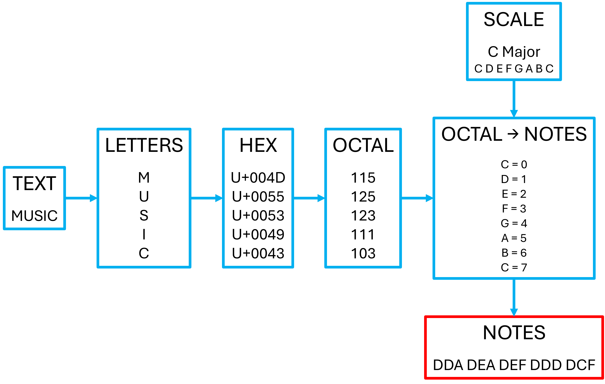
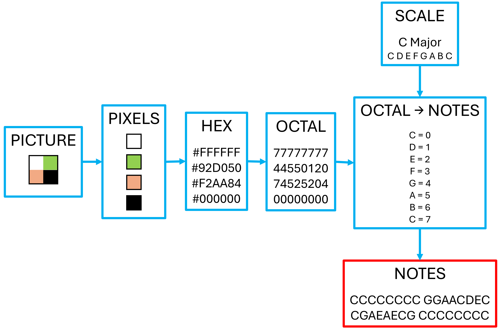

# OctaCon 🎵
The Octal Music Convertor - converting text and pictures into music.

There are two functions for different conversions:
 - **TextaCon** - converting text into music.
 - **PictaCon** - converting pictures into music.

## Table of Contents
- [Installation](#installation)
- [Python Dependancies](#python-dependancies)
- [Basic Usage](#basic-usage)
- [Concept](#concept)

_______

## Installation
1. Clone the repository:
```bash
 gh repo clone sachindias/OctaCon
```
_______

## Python Dependancies
| Package |
|----------|
| numpy |
| pillow |
| mido |

_______

## Basic Usage

Start by importing both scripts:

```
Import TextaCon
Import PictaCon
```

In order to use TextaCon you need a phrase, scale type and root note.
It can be implemented as below for the :

```
TextaCon.Run(phrase="₸H1Ⓢ ↿S ÅN ε×4M☧しE", scale="Major", root="C")
```

In order to use PictaCon you need an image, scale type and root note.
The image will need to in the INPUT_PICTURES folder and the filename (including file type e.g. ".png") will be needed to run the code. 
It can be implemented as below:

```
PictaCon.Run(filename="Tester.png", scale="Major", root="C")
```

Whilst the code will execute in the two above examples, **there won't be outputs without additional parameters**. These parameters work the same for both TextaCon and PictaCon.

### Printing to the Console

To print a summary of notes to the console, you simply need to change the `consoleprint` parameter to `True`:

```
TextaCon.Run(phrase="₸H1Ⓢ ↿S ÅN ε×4M☧しE", scale="Major", root="C",
             consoleprint = True)
```

### Printing to a Text File

To print the summary to a text file, you will need to provide a filename for `textprint` and set the location to save the file to. 

```
TextaCon.Run(phrase="₸H1Ⓢ ↿S ÅN ε×4M☧しE", scale="Major", root="C",
             textprint="Test_func",
             textprint_location = "TEXT_FILES\\")
```


This will save the summary to TEXT_FILES\\Test_func.txt.

### Printing to a MIDI File

Even more useful that printing a summary of the notes, is being able to play them via MIDI. 
As with a text file, you will need to provide a filename for `MIDIprint` and set the location to save the file to.

You will also need to indicate whether you want the notes for each character or pixel to be played as individual sequential notes or chords. 
This can be set by changing `chord` to `True` for chords and `False` for individual notes.
The default is for individual notes.

There are also options to change the length and velocity of notes. 

Velocity is set to a default of 100, but can be changed from 0 to 127 using `veloctiy` and changing the integer number.

The `notelength` is set at a default of 1/4, indicating that each note lasts for one quarter of a bar.

```
TextaCon.Run(phrase="₸H1Ⓢ ↿S ÅN ε×4M☧しE", scale="Major", root="C",
             MIDIprint="Test_func",
             MIDIprint_location = "MIDI_FILES\\",
             chord = False,
             notelength = 1/2,
             veloctiy = 50)
```

This will save the MIDI file to TEXT_FILES\\Test_func.mid, with individual notes of 50 velocity and length 1/2 of a bar (or 2 notes per bar).

### Playing in the Console

If you want to instead hear the notes in the console you can do so by setting `play` to `True`:

```
TextaCon.Run(phrase="₸H1Ⓢ ↿S ÅN ε×4M☧しE", scale="Major", root="C",
             play = True)
```

### Adding or Removing Empty Notes

There are two final options for both Run functions: 
1. To remove 0s from the beginning of an octal number, if the code for every character or pixel begins with 0s.
This affects codes such as 00115 or 00103. 
There is no difference in terms of octal writing these as 115 and 103 instead.  
However this will not be possible if one of the one of the octal numbers is 11111 for instance. 
 
```
TextaCon.Run(phrase="₸H1Ⓢ ↿S ÅN ε×4M☧しE", scale="Major", root="C",
              remove0=True)
```

2. To add extra 0s to the front of the octal number. 
This can be useful for instance, if you want to print the MIDI files to have a particular number of notes per bar. 
Simply specify the number of notes you want as an integer for the parameter `length`.
**This will not work if the length is less than the current number of digits in the octal number.**

```
TextaCon.Run(phrase="₸H1Ⓢ ↿S ÅN ε×4M☧しE", scale="Major", root="C",
              length = 3)
```


### Scales

Scales are set up with the name of the scale followed by the location of the 8 notes (in semi-tones) relative to the root note. 
The root note is always the location 1, if the next note is 2 semi-tones above, the location is 3, if it is 1 semi-tone the location is 2.  
The final note is the same as the root so will be 1. 
**Between each entry there must be three spaces and numbers should not exceed 12**. 

As an example see for the major scale below:

```
major   1   3   5   6   8   10   12   1
```

For C major this would translate to: C D E F G A B C


To add, delete or amend the saved scales you can either do so manually or using the functions defined in Scales.py.

To add a scale you, must provide the name of the new scale and the note locations as a list.

To delete a scale, you only need to give the name of the scale you wish to delete.

To amend a scale (i.e. change the name or one of the note locations), you must provide:
- the type of change (`note` or `name`)
- the scale affected
- the new name, if you are changing the name
- the position of the note from 1-8 in the scale, if you are changing a note
- the new note location, if you are changing a note

The below code:
- Adds a test scale with locations: 1, 2, 4, 6, 8, 10, 12, 1
- Amends the name of the test scale to "test_scale" (previously "test")
- Amends the 4th note in the test scale to 7 (previously 6)
- Deletes the test scale a test scale


```
Import Scales

Scales.Add("test", [1,2,4,6,8,10,12,1])
Scales.Amend(change = "name", scale = "test", name = "test_scale")
Scales.Amend(scale = "test_scale", change = "note", position = 4, note = 7)
Scales.Delete("test_scale")
```

_______

## Concept
The basic concept behind OctaCon is to convert text and pictures to music using octal (see https://en.wikipedia.org/wiki/Octal). 
This is particularly beneficial for music as octal is a base-8 numerical system and many scales have 8 notes (from root note to octave). 

As the exact implementation is different for converting text to music (TextaCon) and converting pictures to music (PictaCon) we will run through these separately below. 
The main difference concerns how we get from text or pictures to octal in the first place.

### TextaCon
The process follows the flowchart and is described below:



1. We need to start with some text, the word MUSIC in this case.
2. Next, we decompose this into the individual letters.
3. Each symbol, number or letter has a unique Unicode (https://home.unicode.org) number associated with it. 
This is written as "U+" followed by the number in hexadecimal (https://en.wikipedia.org/wiki/Hexadecimal). 
For example the letter M is U+004D. 
4. Ignoring the "U+" part, we can convert the hexadecimal (base-16 numerical system) number for each letter into octal (base-8 numerical system).
For M this gives 115 in octal.
5. Now we need an 8 note scale, for simplicity we will use C Major (C, D, E, F, G, A, B, C)
6. Numbering each note in the scale from 0 to 7, we can turn out octal numbers into notes. 
Taking the example of M again, D = 1 and A = 5, meaning our notes are DDA. 
7. Once this has been done for each character, we have our final list of notes. Here we have:

    DDA DEA DEF DDD DCF

8. This can now be played on an instrument or using MIDI.


### PictaCon
The process follows the flowchart and is described below:



1. We need to start with a picture, 4 coloured pixel in this case.
2. Next, we decompose this into the individual pixels, going left → right and top → bottom.
3. Colours can be described with RGB values, with red, green and blue on 3 separate 0-255 scales. 
For example, the colour white has values of 255 on each of these 3 scales. 
We can write the values of these scales in hexadecimal, which gives us FF for white.
Stringing these together and adding a "#" we can create a unique code for each colour. 
As white is FF for each scale, we get #<span style="color: red;">FF</span><span style="color: green;">FF</span><span style="color: blue;">FF</span>.
4. Ignoring the "#", we can convert the hexadecimal number into octal.
5. Following steps 5-8 from TextaCon above we again can convert our octal numbers into music. 


